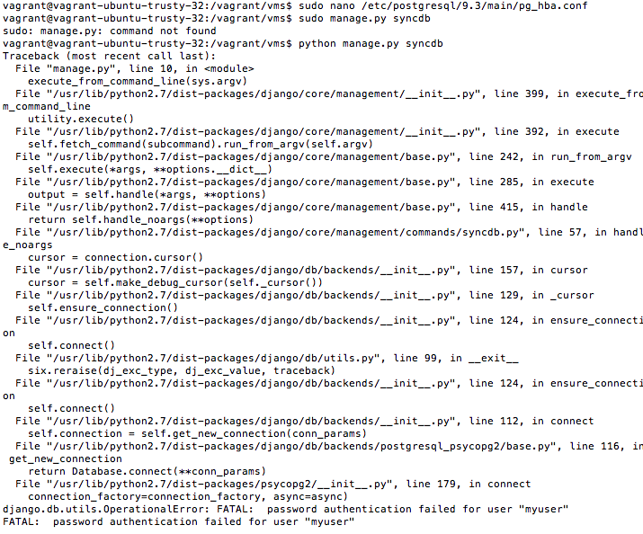

# Getting Help and Asking Good Questions

### Overview

There will be times when you face problems, whether it is when you are setting up your 	development environment, making changes to the code, or even just looking through the code. But, don't panic yet! When you face tough times like these, you must first calm down and carefully analyze your situation. Look at the error message, if any, and look up your problem on websites like Stack Overflow. There is a high probability that your question will already be answered on those types of forums.

## Who to contact

However, in the case that you wish to contribute to VMS, and you are having trouble doing so, you can contact contributors through systers-dev@systers.org. There you will find members who will be very willing to assist you. Or,you can contact them right here on Github!

## How to Make Your Questions 'Good'

Even the main contributors need a lot of information to be of any assistance. To ask a good question, you need to include as much detail as possible about the problem you are encountering. For example, provide your mentors with screenshots of the error message, your development environment, and anything you may have changed and could be causing the problem. In addition, you should give them ample background of what you did before the error occurred so that they may know the context of the error. Just remember, be as detailed and specific as possible so other contributors may help!

## Example

Let's say that I am having trouble setting up the development environment for VMS. What should I do first?

Well, here's how to approach the problem:

#### What exactly is the error? In my case, I am receiving the error message below:

#### Analyze the problem. What exactly is the error? Here, it is password authentication failed for user myuser

Now knowing this, Google this exact message.

As you can see, there are a huge variety of resources on the exact same issue. Many other people have experienced the same thing you are!

#### If you still do not find the answer, though, then it is time to use Plan B. Shoot a message to systers-dev@systers.org with the screenshots and background information they will need to help you :)
